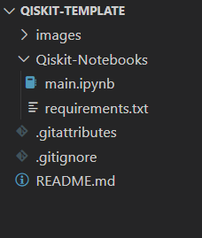

<h1 align="center">Qiskit Template</h1>

> [!NOTE]
> For more help check out this video: [How to Install Qiskit | Coding with Qiskit 1.x | Programming on Quantum Computers](https://youtu.be/dZWz4Gs_BuI?si=m1JOLvMsmwZMCxka)

##  🌱 Getting Started

### 🧰 Requirements
- Python | 3.9 | 3.20 | 3.11 | 3.12 | 3.13 |
- Jupyter Notebook
  - VS Code: Install Jupyter extension
  - Outside VS Code: Run ```pip install notebook``` in your terminal

### Quick Start
1. Clone the repository:
```
git clone https://github.com/gbeckstrom/Qiskit-Template.git
```
Your project directory should resemble the following in your preferred IDE:



2. Open the terminal in the ``Qiskit-Template`` folder and run:
```
pip install -r ./requirements.txt
```

3. Open the **.ipynb** file and select your Python environment:
- Click **Select Kernel** in the top-right cornerof the notebook interface


4. Run the first **code cell** to verify the setup.
   - if the notebook environment requires **ipykernel**, simply **click install** 


## 📚 Resources
- [IBM Quantum Computing | Qiskit](https://www.ibm.com/quantum/qiskit)
- [IBM Quantum Documentation](https://quantum.cloud.ibm.com/docs/en)
- [qiskit | GitHub](https://github.com/Qiskit/qiskit)
